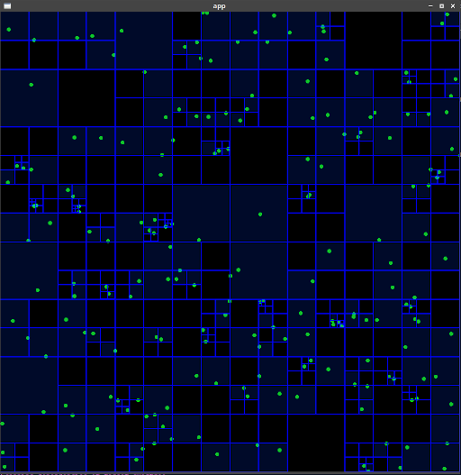

# 2D Collision Detection using Quadtree

## Description

A quad-tree implementation for 2D collision detection  built from scratch with C++ using [SFML](https://www.sfml-dev.org/). This program was made for fun but also to practice techniques used in games. It is most probably not optimized.



## Installation

### Dependencies

This project uses `cmake` and SFML library:
```
sudo apt-get install cmake libsfml-dev
```

## Build

1. Clone this repository
2. Compile with `mkdir build && cd build && cmake ..`
3. Go to binary folder `cd ./bin`
4. Run with `./quadtree`
## Game Design
